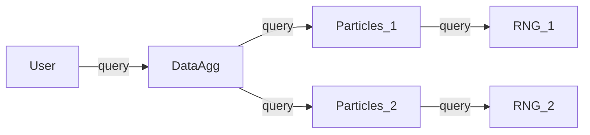
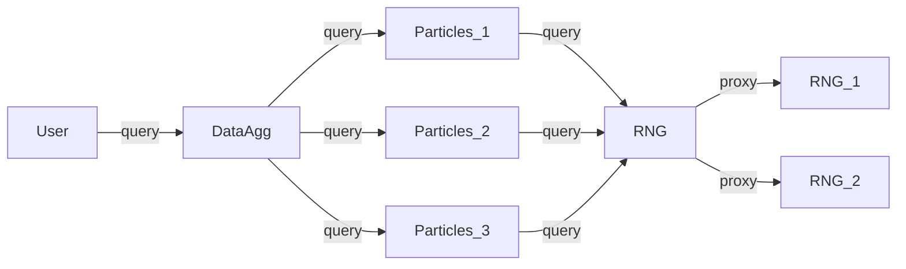

# Reproducible Distributed Scientific Computing

## Problem

We'll work with a 2-dimensional [random walk](https://en.wikipedia.org/wiki/Random_walk) application with different components.

- *__(Pseudo) Random Number Generator:__* Generates pseudo-random numbers which are used to determine the steps each particle takes.  (We'll learn more about random number generation below.)
- *__Particles:__* Handles position and movement of multiple particles.
- *__Data Aggregation:__* Aggregates information about the particles (could be distance travelled by each particle, distribution of all particles in space, etc.)

The interaction of the three components is organised like:

## Discussion of the components

### Particles

We'll handle `N` particles which are moving in small and random discrete steps. For a particle with index `n` which is at step `l`, the movement can be expressed as
$$x^n_{l+1} = x^n_{l} + \delta x$$
$$y^n_{l+1} = y^n_{l} + \delta y$$
$$\delta x, \delta y \in [-1, 1)$$

where $\delta x$ and $\delta y$ are drawn from a uniform random distribution between -1 and 1.

### Data Aggregation

With the position of particle $n$ at step $l$ being denoted as
$$(x^n_l, y^n_l)$$

we'll calculate two quantities which describe the overall distribution of the particles at step $l$:

The center of mass
$$COM_l = (\bar{x}_l, \bar{y}_l)$$
with
$$\bar{x}_l= \frac{1}{N}\sum_{n=1}^N x^n_l$$
$$\bar{y}_l= \frac{1}{N}\sum_{n=1}^N y^n_l$$

is the point in space where the mass-weighted sum of positions averages to zero. (Here, we assume that all particles have the same mass.)

The moment of inertia (about the center of mass)
$$MOI_l = \sum_{n=1}^N ((x^n_l-\bar{x}_l)^2 + (y^n_l-\bar{y}_l)^2)$$

### (Pseudo)-Random Number Generation (pRNG)

Generating pseudo-random numbers is an own research field. There are criteria for "good" which are along the lines of requiring convergence towards the desired distribution and independence (or lack of predictability) between subsequent numbers.

A pRNG has an internal state wich is changed everytime a random number is drawn. By choosing the initial state of the pRNG, we completely determine the  sequence of random numbers it will produce.

For different use cases, there's different ways of chosing the initial state of the pRNG: If you're building a game or create cryptographic keys, you want to avoid being able to reproduce the initial state.

In _scientific_ applications, however, we aim at reproducibility. Hence, we want to be able to control the initial state of the pRNG.

In our random-walk application, we use a very simple pRNG: The [linear congruential generator](https://en.wikipedia.org/wiki/Linear_congruential_generator) (LCG).  This generator is based on the mapping
$$
R_{m+1} = (a \cdot R_{m} + c)\mod m
$$
where $a$, $c$, and $m$ are unsigned integers and where $m$ determines the max. range of the possible (unsigned integer) random numbers $R$.

The LCG has many disadvantages which render it un-usable for real scientific applications. Here, however, we'll take advantage of the very simple structure of the LCG and ignore these.

*__Note__ that for "good" pRNG's, the internal state can be quite large (e.g. 2.5kB for the standard generator used in Numpy and Matlab). For LGCs, hoever, the internal state is completely determined by the single unsigned integer $R$.*

## Parallelisation

To make use of concurrency or of ohter resources like main memory or IO bandwidth, we often need to parallelise scientific applications. For our simple random walk problem, can follow different strategies.

We could replicate all parts (and bring everything together in the data aggregation step):

Or we could go for more complex patterns (where `RNG` is a load balancer for multiple instances of `RNG`s):

*__Note__ that we can only parallelise into multiple instances of `Particles`, because in our simple problem, the individual particles don't interact with each other.*