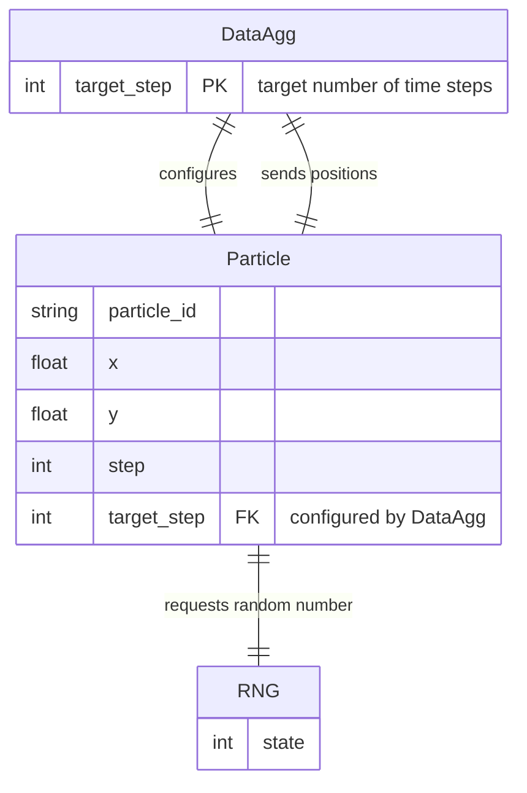
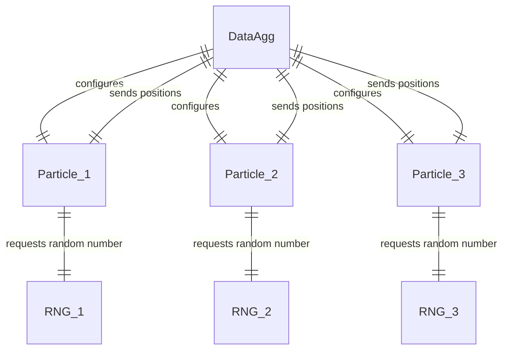
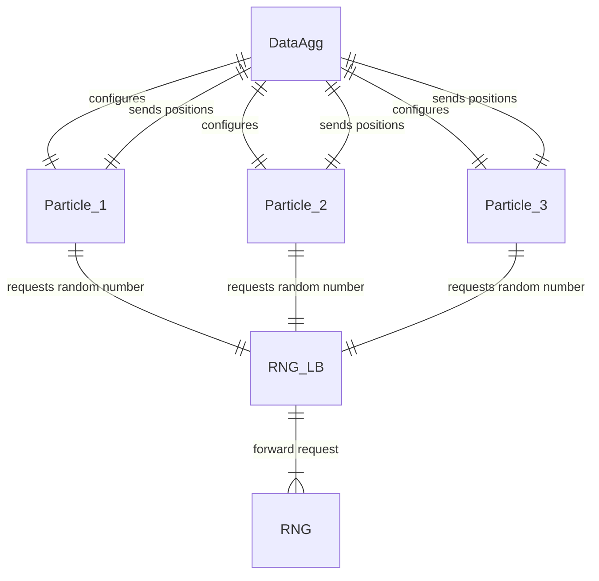
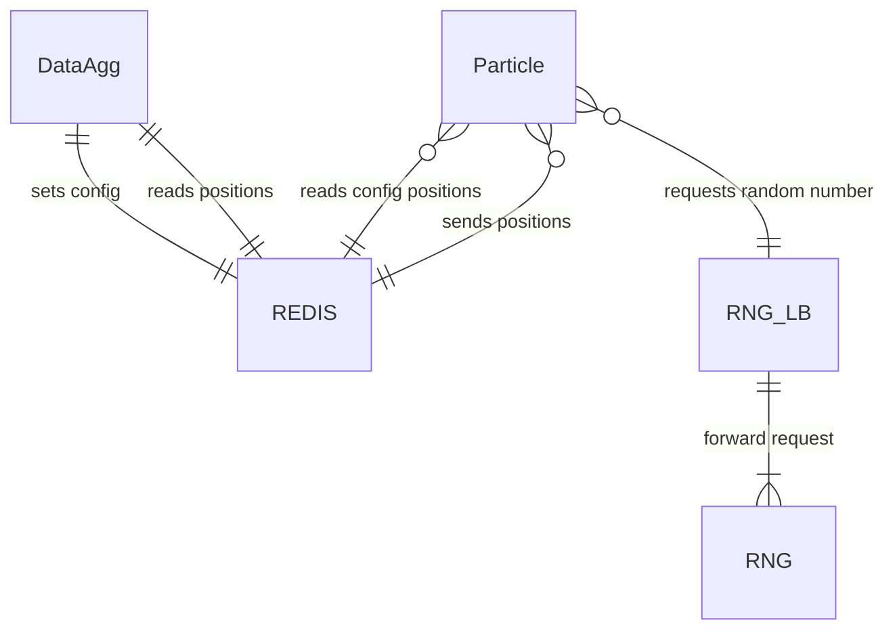
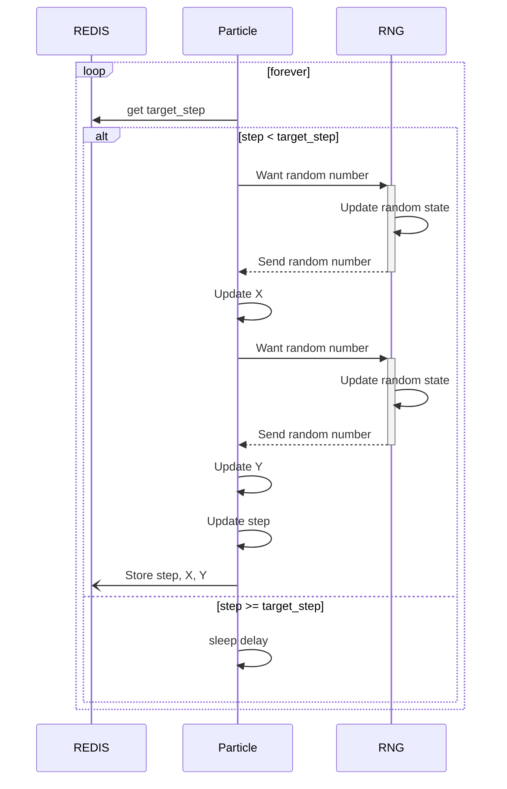
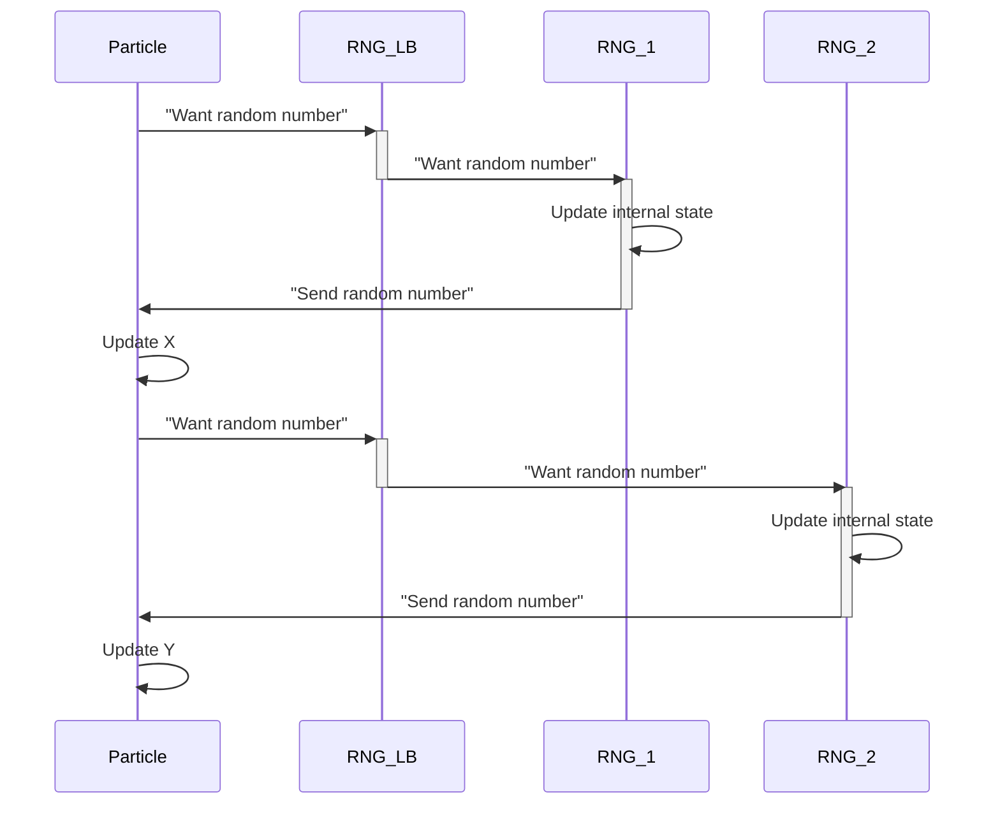
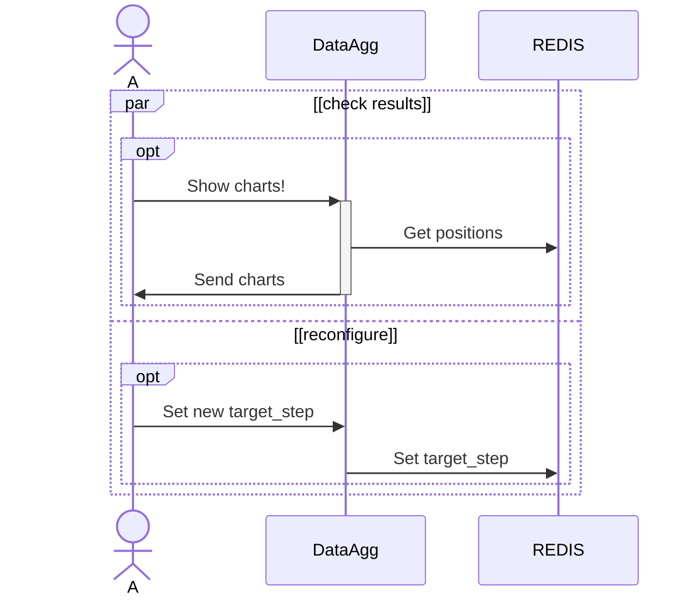

# Reproducible Distributed Scientific Computing

## Problem and introduction

We'll work with a colleciton of particles each of which performs a 2-dimensional [random walk](https://en.wikipedia.org/wiki/Random_walk).
This simple model has many similarities with actual models for physical or biophysical systems (e.g., molecular dynamics, interaction of predadors / prey, ...).

## Implementation

- *__(Pseudo) Random Number Generator:__* Generates pseudo-random numbers which are used to determine the steps each particle takes.  (We'll learn more about random number generation below.)
- *__Particles:__* Handles position and movement of multiple particles.
- *__Data Aggregation:__* Aggregates information about the particles (could be distance travelled by each particle, distribution of all particles in space, etc.)

The relationship can be visualised as follows:



### Discussion of the components

#### Particles

We'll handle `N` particles which are moving in small and random discrete steps. For a particle with index `n` which is at time step `t`, the movement can be expressed as
$$x_{n,t+1} = x_{n,t} + \delta x_{n,t}$$
$$y_{n,t+1} = y_{n,t} + \delta y_{n,t}$$
$$\delta x_{n,t}, \delta y_{n,t} \in [-1, 1)$$
where $x_{n,t}$ and $y_{n,t}$ are positions of particle $n$ at step $t$, and $\delta x_{n,t}$ and $\delta y_{n,t}$ are drawn from a uniform random distribution between -1 and 1.

#### Data Aggregation

We'll calculate two quantities which describe the overall distribution of the particles at time step $t$:

The _center of mass_
$$COM_t = (\overline{x_t}, \overline{y_t})$$
with
$$\overline{x_t} = \frac{1}{N}\sum_{n=1}^N x_{n,t}$$
$$\overline{y_t} = \frac{1}{N}\sum_{n=1}^N y_{n,t}$$

is the point in space where the mass-weighted sum of positions averages to zero. (Here, we assume that all particles have the same mass.)

The _moment of inertia_ (relative to the center of mass)
$$MOI_t = \sum_{n=1}^N ((x_{n,t}-\overline{x_t})^2 + (y_{n,t}-\overline{y_t})^2)$$

determines the torque one needs to apply in order to achieve an angular acceleration. _(More mass away from the center of mass means higher $MOI$.)_

#### (Pseudo)-Random Number Generators (pRNG)

Generating good pseudo-random numbers is an own research field. There are criteria for "good" random numbers which are along the lines of requiring convergence towards the desired distribution and independence (or lack of predictability) between subsequent numbers.

A pRNG has an internal state wich is changed everytime a random number is drawn. By choosing the initial state of the pRNG, we completely determine the  sequence of random numbers it will produce.

For different use cases, there's different ways of chosing the initial state of the pRNG: If you're building a game or create cryptographic keys, you want to avoid being able to reproduce the initial state.

In _scientific_ applications, however, we aim at reproducibility (or at least repeatability). Hence, we want to be able to control the initial state of the pRNG.

In our random-walk application, we use a very simple pRNG: The [linear congruential generator](https://en.wikipedia.org/wiki/Linear_congruential_generator) (LCG).  This generator is based on the mapping
$$
R' = (a \cdot R + c)\mod m
$$
where $a$, $c$, and $m$ are unsigned integers and where $m$ determines the maximum range of the possible (unsigned integer) random numbers $R$.

The LCG has many disadvantages, which render it un-usable for real scientific applications. Here, however, we'll take advantage of the very simple structure of the LCG and ignore these.

*__Note__ that for "good" pRNG's, the internal state can be quite large (e.g. 2.5kB for the standard generator used in Numpy and Matlab). For LGCs, hoever, the internal state is completely determined by the single unsigned integer $R$.*

## Parallelisation

To make use of concurrency or of other resources like main memory or IO bandwidth, we often need to parallelise scientific applications. For our simple random walk problem, can follow different strategies.

We could replicate all parts (and bring everything together in the data aggregation step):



Or we could go for more complex patterns (where `RNG_LB` is a load balancer for multiple instances of `RNG`s):



Another possibility is the following:

Here, we added a REDIS store able to relay information between multiple instances of `Particle` and the `DataAgg` instance. _(Note that we've switched to a more concise notation indicating the number of instances of each entity on the link.)_

*__Note__ that we can easily parallelise into multiple instances of `Particles`, because in our simple problem, the individual particles don't interact with each other.*

## Reproducibility

To completely reproduce results with different parallel layouts, we'd need to control the following aspects:
- initial positions $(x^n_0, y^n_0)$ of all particles — _We'll solve this by starting all particles at $(0, 0)$._
- initial states of the pRNG — _We'll focus on these._

*__Note__ that we don't take into account effects from roundoff errors. If we cared for them, we'd also need to completely control the order of execution of all arithmetics in particle movement and in the data aggregation. If we'd simulate a chaotic physical system, we'd need to control roundoff errors as well.*

## Communication

For the last layout above, let's look at the sequence of interactions.

### Particle position update

Each particle instance will poll the REDIS store for configuration (the desired number of steps to be recorded), and query the necessary random numbers from the RNG.



### Multiple RNGs behind load balancer

With the `RNG` above actually forwarding the request for random numbers to one of multiple backend `RNG`s:


### User inspection / intervention

At the same time, one or more users can interact with the data aggregation:



## Code

The parallel layout detailed above has been implemented using Docker compose. See the [services/](services/) directory for details.

To run the services, do
```shell
$ git clone https://github.com/willirath/2022_reproducible_distributed_scientific_computing
$ cd services
$ docker-compose build
$ docker-compose up
```
To stop the application, type `CTRL-C` followed by
```shell
$ docker-compose down
```

_**Note** that there is a service called `jupyterlab` which can be reached on `http://127.0.0.1:8888/lab` (password: admin). This service is not necessary for the application to run, but it provides us with an easy interface to interact with all the services in our application._

## Familiarize yourself (to be done within the lecture)

0. Read everything in [services/](services/) and make sure you understand what each part does.

1. Run the setup for the following cases, each time checking and saving the charts (see http://127.0.0.1:8080/charts). Discuss your obervations.
   - 4 RNGs, 4 Particles
   - 4 RNGs, 4 Particles (run again)
   - 1 RNG, 4 Particles
   - 1 RNG, 4 Particles (run again)

By now, you should have observed a problem with reproducibility / repeatability which is present for the case with a single RNG.  You also should have observed a problem with $MOI$ for the parallel RNGs.

## Exercises (on your own time)

Consider one of the following exercises:

### Make the RNG reproducible

Above, we found two problems with multiple RNGs.