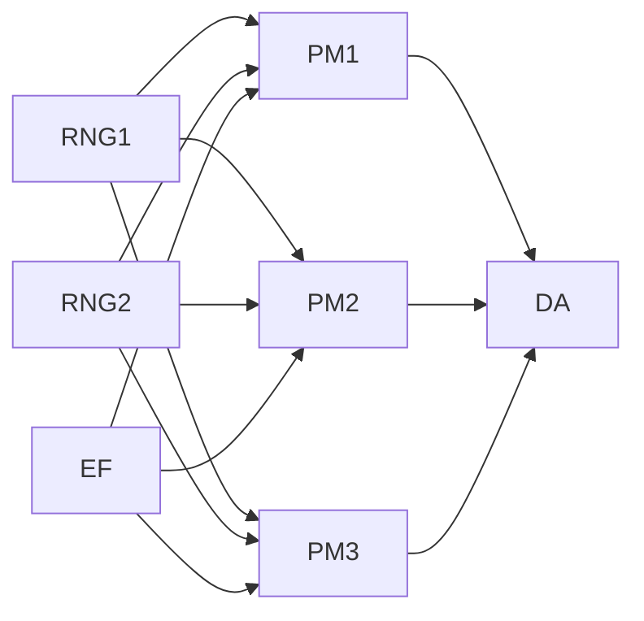

# Reproducible Distributed Scientific Computing

## Problem

Random Walk application with different distributed components:

- Random Number Generation
- Particle Movement
- External Fields
- Data Aggregation

