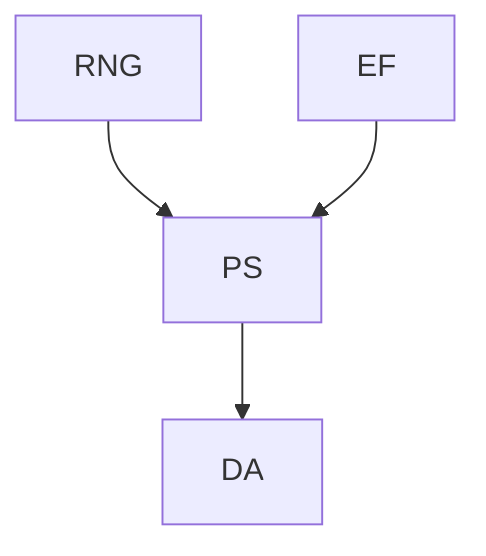
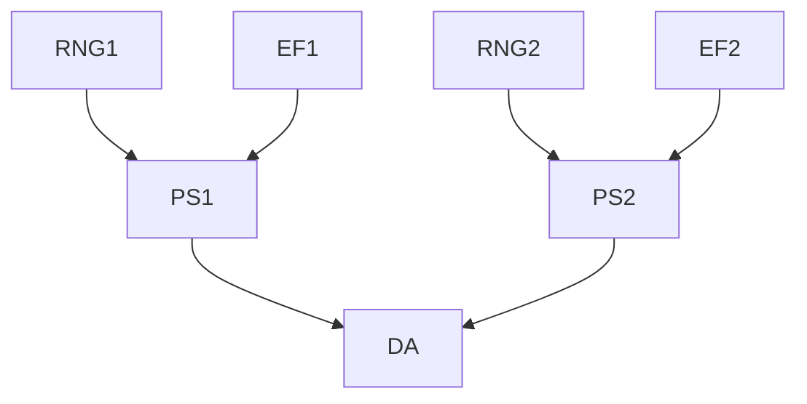
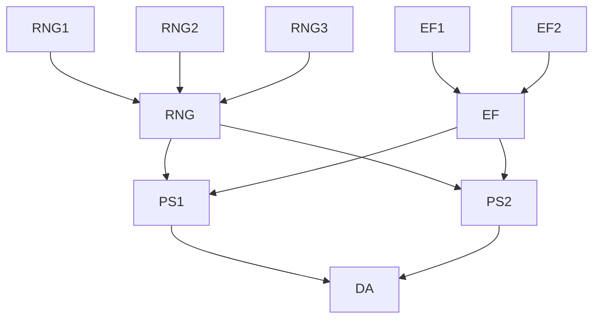

# Reproducible Distributed Scientific Computing

## Problem

Random Walk application with different components:

- Random Number Generation
- Particle Set
- External Fields
- Data Aggregation

## Parallelisation

We can follow different strategies here

Either, we replicate all parts (and bring everything together in the data aggregation step):

Or, depending on where the actual cost is spent, we could go for more diverse patterns (where `EF` and `RNG` are load balancers):

